# SmokedMeat Tutorial

A step-by-step walkthrough against the [whooli](https://github.com/whooli) playground - a deliberately vulnerable CI/CD environment designed for safe testing.

**Time:** ~15 minutes
**Prerequisites:** Docker, `make`, a GitHub account with a classic PAT (`public_repo` scope)

---

## 1. Install and Launch

Clone SmokedMeat and run the quickstart. Go is not required unless you want to contribute or make changes to the source.

```bash
git clone https://github.com/boostsecurityio/smokedmeat.git
cd smokedmeat
make quickstart
```

The quickstart pulls Docker images, starts the Kitchen C2 teamserver and NATS message bus, establishes a Cloudflare tunnel for agent callbacks, and launches the Counter TUI. First run takes a moment while images pull.

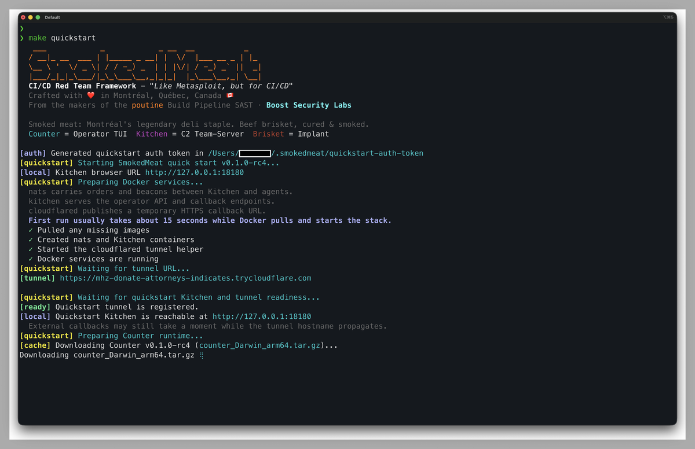

Counter launches automatically into the setup wizard once the stack is ready.

---

## 2. Setup Wizard

Steps 1-4 (Kitchen URL, SSH key, operator name, deploy key) are pre-configured by the quickstart and advance automatically or with a single Enter. These steps matter for advanced red team use cases - connecting to a shared team Kitchen, using your own domain and IP for C2 instead of the Cloudflare tunnel, or registering an SSH key for persistent operator sessions. For a first run, just press through them.

### Step 5: GitHub Token

Choose how to provide your token. For a first run, **Paste a Personal Access Token** is the quickest. For day-to-day use, the 1Password integration lets you reference a secret without ever copy-pasting the token value, and the GitHub CLI option picks up whatever `gh auth token` returns.

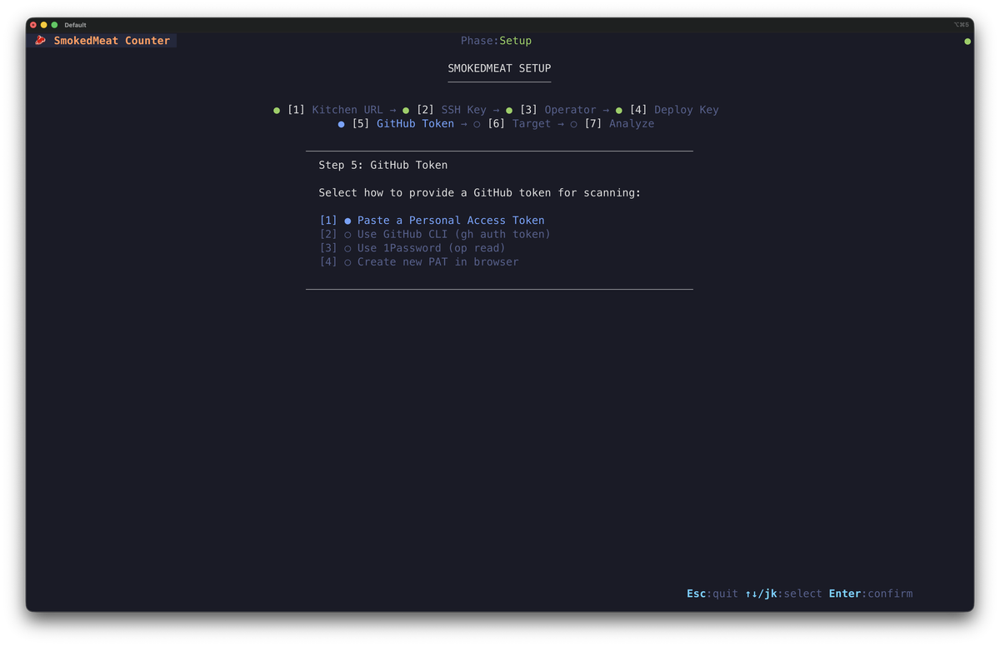

After selecting, paste your classic PAT. The input is masked.

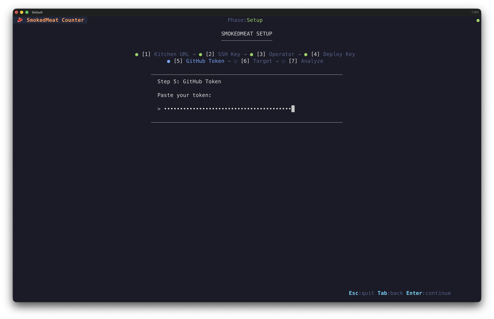

> **Tip:** Use a classic PAT scoped to `public_repo` only. It's the easiest option - fine-grained PATs can work but require getting every permission right, which gets tedious. `public_repo` is sufficient for whooli and safe: even if the token were ever exposed, its blast radius is limited to public repositories.

### Step 6: Target

First choose whether to target a whole organization or a single repository.

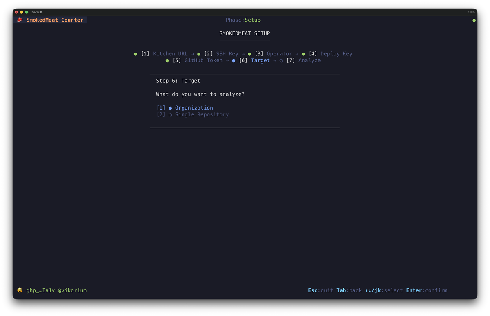

Select **Organization**, then type `whooli`.

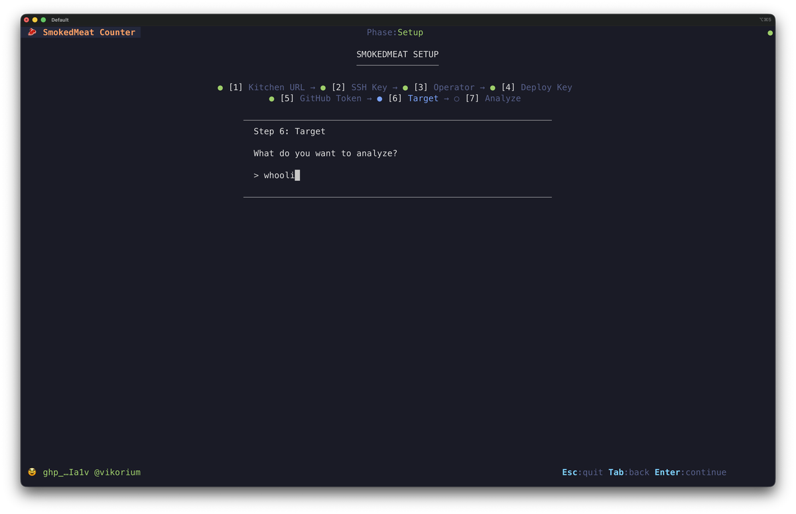

Press **Enter**. Analysis kicks off automatically as step 7.

---

## 3. Recon: Reading the Attack Tree

When analysis completes, the Counter enters **Phase: Recon** with the attack tree fully populated.

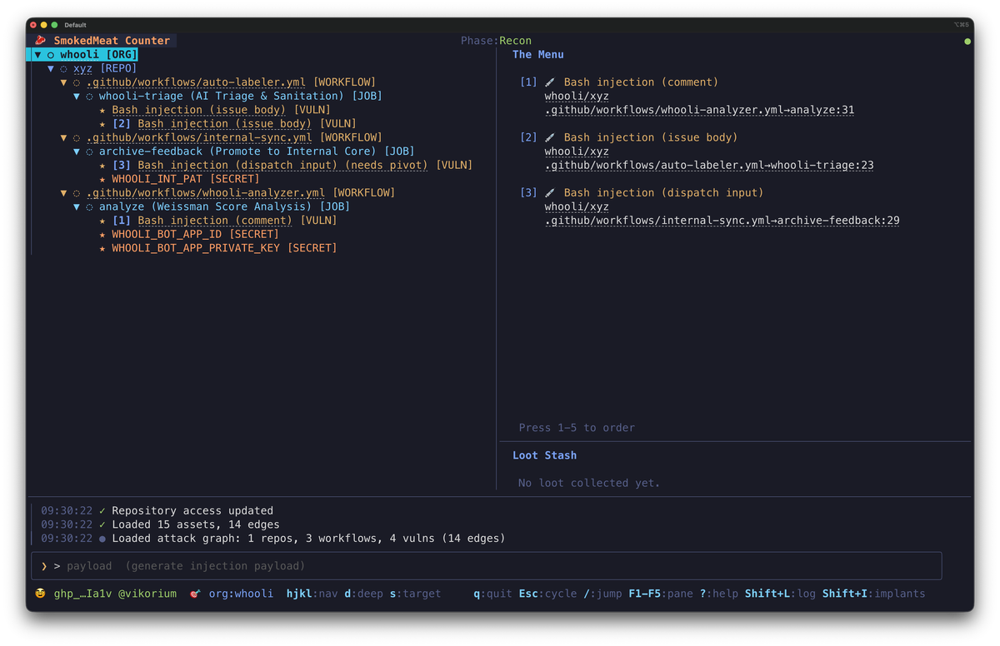

The tree is organized: **Org > Repo > Workflow > Job > Vulnerability**. Secrets discovered in workflow definitions (like `WHOOLI_INT_PAT`, `WHOOLI_BOT_APP_PRIVATE_KEY`) appear under their job. The right panel shows **The Menu** - the top-ranked exploitable vulnerabilities numbered for quick selection. That ranking is driven by what poutine found at static analysis time: vulnerabilities whose jobs already reference high-value secrets (API keys, App private keys, PATs) get surfaced first, because exploiting them is likely to yield useful loot.

Navigate with arrow keys or `j`/`k`. Press **Enter** to expand/collapse nodes. Press a number (1-5) to jump directly to a menu item.

> **What you're seeing:** poutine scanned all of whooli's workflows and found bash injection vulnerabilities where untrusted input (`${{ github.event.comment.body }}`, `${{ github.event.issue.body }}`, etc.) flows directly into `run:` steps. These are live, exploitable entry points.

---

## 4. Payload Wizard

Select a vulnerability and press **Enter** to open the Payload Wizard. This is a 3-step guided flow that adapts entirely to the selected vulnerability. The injection payload, delivery method options, and confirmation copy all change based on what was found: a bash injection via `issue_comment` looks very different from a `pull_request_target` unsafe checkout, a `workflow_dispatch` with user-controlled inputs, or a LOTP-based Pwn Request where the payload lands inside a build tool config rather than a workflow expression. SmokedMeat picks the right technique for the context automatically.

### Step 1/3 - Vulnerability Summary

Review what you're about to exploit: the injection type, trigger, repo, workflow, job, the exact vulnerable expression, and any gate condition.

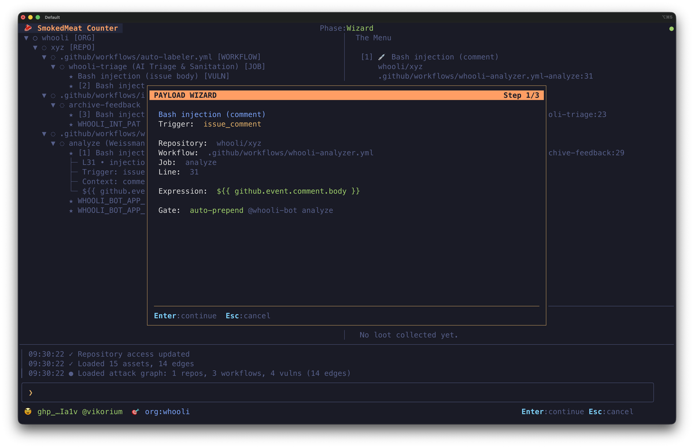

In this example: a bash injection via `issue_comment` trigger, expression `${{ github.event.comment.body }}`, gated by `@whooli-bot analyze` - SmokedMeat prepends that trigger string automatically.

### Step 2/3 - Delivery Method

Choose how to deliver the payload. Options are tailored to the vulnerability's trigger type.

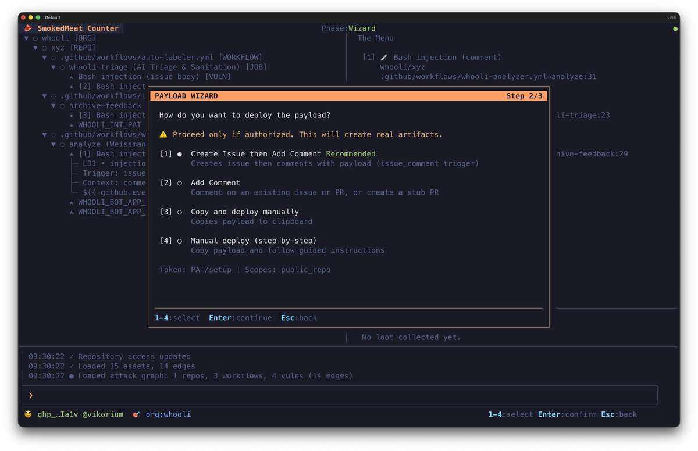

For `issue_comment` vulnerabilities, **Create Issue then Add Comment** is recommended - SmokedMeat opens a new issue and posts the payload comment in a single automated flow.

> **Note:** The warning is real - this creates actual GitHub artifacts on the target. whooli is designed for this: experimenting on it is explicitly authorized and expected. For any other target, make sure you own it or have explicit written authorization.

### Step 3/3 - Confirm and Deploy

Review final options before deploying.

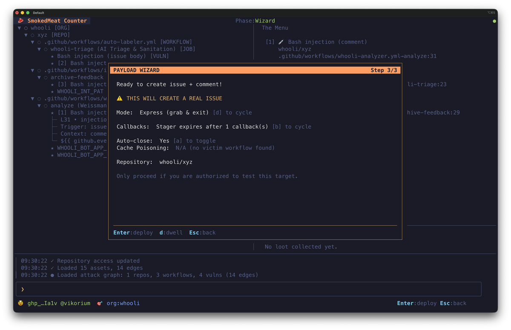

- **Mode:** Express (smash-and-grab, exits after first callback) or Dwell (interactive session, press `d` to toggle)
- **Auto-Close:** Automatically closes the issue after the implant phones home
- **Callbacks:** How many callbacks this stager will accept before expiring. Default is 1 - useful when a vulnerable workflow runs on multiple parallel runners and you want to collect loot from all of them rather than stopping at the first agent
- **Cache Poisoning:** N/A here - only available when a victim workflow is found

Press **Enter** to deploy.

---

## 5. Waiting for Callback

The Counter shifts to **Phase: Waiting**. The stager is registered and the issue has been created on GitHub.

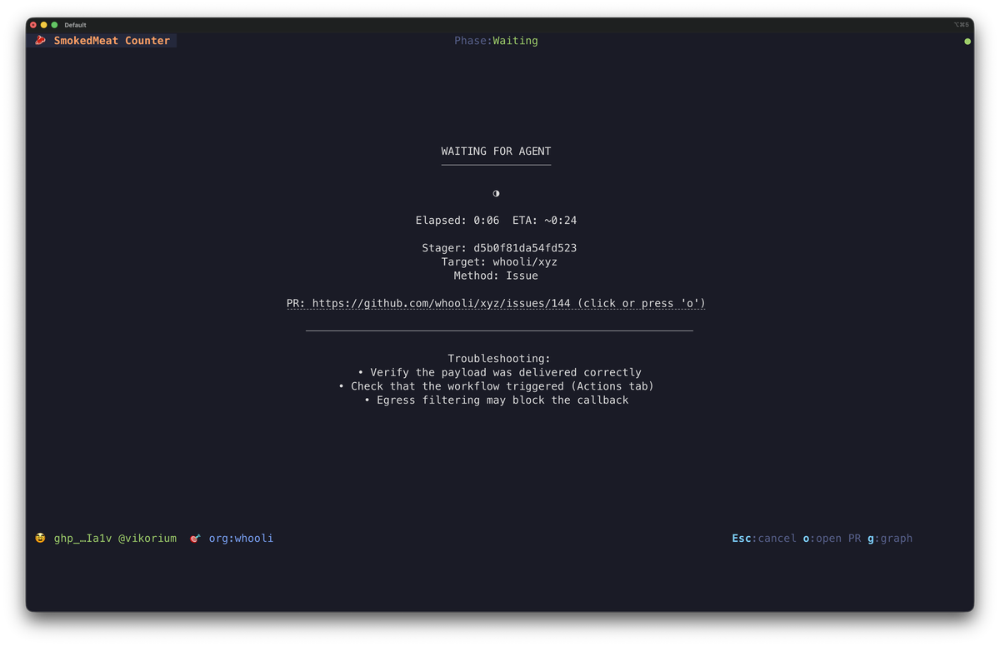

When whooli's vulnerable workflow runs and processes the comment, it executes the injected payload, which downloads and runs the Brisket implant. For lean workflows like whooli's, the whole cycle - from issue creation to agent callback - typically takes around 30 seconds. Workflows with many steps before or after the injection point will take longer. Press `o` to open the created issue in your browser and watch the run live, or `g` for the attack graph.

---

## 6. Post-Exploit: Loot and Pivoting

When the implant phones home, the Counter transitions to **Phase: Post-Exploit** automatically.

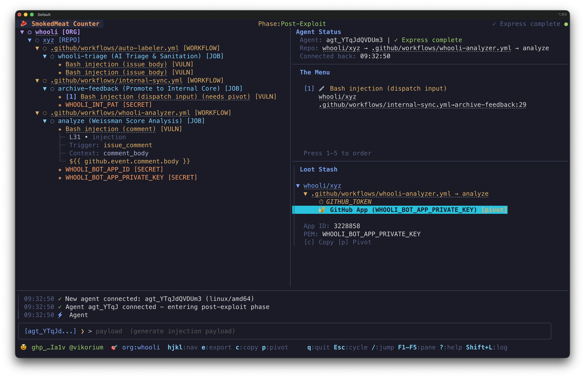

The **Loot Stash** shows what the implant extracted from the runner:
- `GITHUB_TOKEN` - the workflow's GitHub token
- `WHOOLI_BOT_APP_PRIVATE_KEY` - a **GitHub App private key** (PEM), highlighted in cyan with a `pivot` hint

The App private key is the interesting credential. SmokedMeat has already identified it as pivotable - press `p` or type `pivot` to act on it.

### GitHub App Pivot

SmokedMeat exchanges the captured PEM for a GitHub App installation token. The attack tree re-populates with the new token's reach:

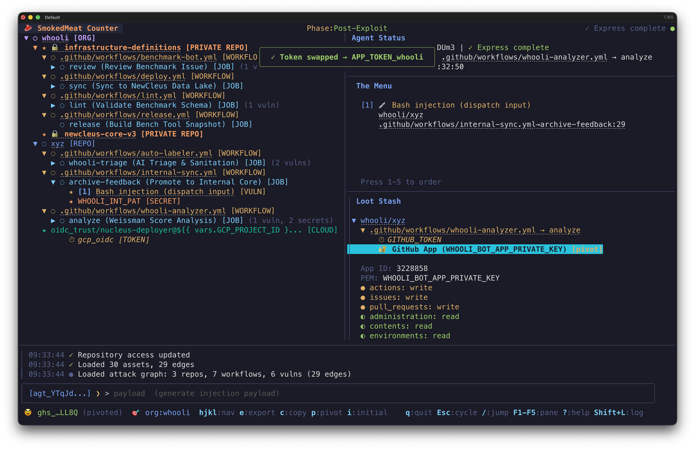

From one comment on a public repo, you now have:
- **Private repos discovered:** `infrastructure-definitions`, `nucleus-core-v3`, and more
- **Token permissions exposed:** `actions:write`, `issues:write`, `pull_requests:write`, `administration:write`
- **New attack surface:** 7 workflows and 6 vulnerabilities across 3 repos (up from 4 vulns in 1 repo)

The discovered repos are automatically queued for analysis. The blast radius keeps expanding.

---

## 7. Navigating with Omnibox Search

At any point, press `/` to open the omnibox and fuzzy-search across repos, workflows, jobs, vulnerabilities, and loot.

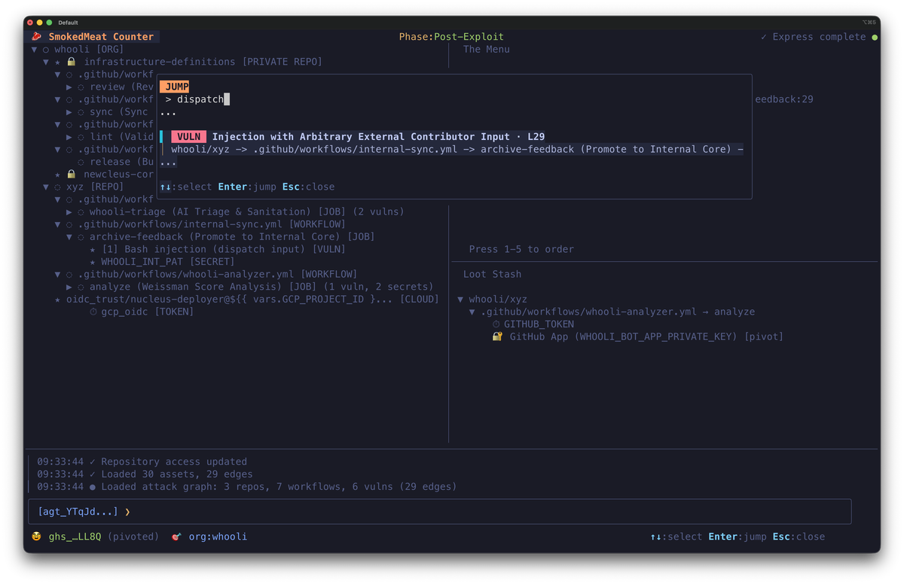

---

## 8. Attack Graph

Type `graph` or press `g` to open the browser-based attack graph. It's a live Cytoscape.js diagram of the full kill chain, updating in real-time via WebSocket as you discover new nodes.

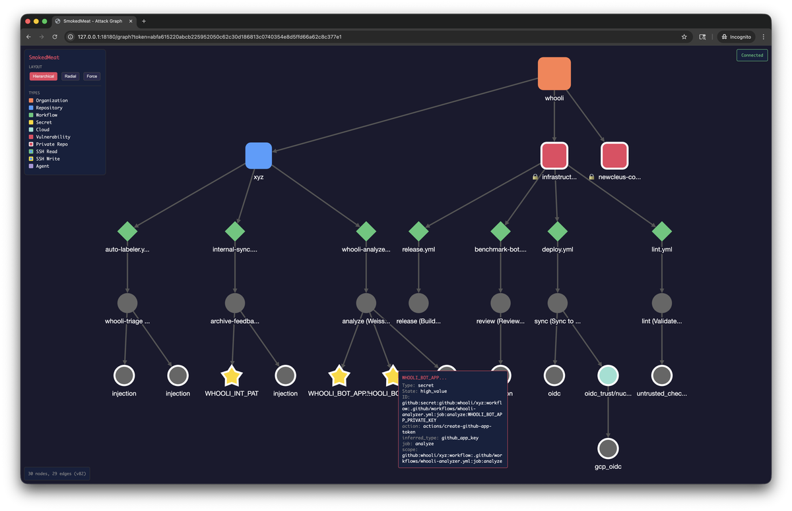

The graph shows the full picture at a glance: the org at the top, public and private repos branching out, workflows and jobs below them, and vulnerabilities (diamonds) and secrets (stars) at the leaves. Click any node to inspect its details - the tooltip shows injection expressions, secret names, token scopes, and pivot hints. This is the view to share with your CISO.

---

## 9. Cleanup

Press `q` to quit the Counter TUI, then stop the quickstart stack:

```bash
make quickstart-down       # Stop containers
make quickstart-purge      # Stop and delete all data (optional)
```

Auto-Close handles the issue cleanup automatically if toggled on before deploying.

---

## What's Next

### Run against your own org

Replace `whooli` with your organization name during setup. Use a classic PAT with `repo` scope to reach private repositories. SmokedMeat will scan the full org and present the same ranked menu of exploitable vulnerabilities.

### Go deeper on post-exploit

- **`deep-analyze <repo>`** - Layers Gitleaks on top of poutine, scanning git history for secrets committed to code: private keys, GitHub PATs, fine-grained tokens, PKCS#12 files. Run this after an initial analysis to surface loot before you even deploy.
- **`token-test`** - Probe any captured token against GitHub API endpoints to enumerate its exact permission scopes and list of accessible repositories and orgs.
- **`env`** - On Linux runners, scans the GitHub Actions Runner.Worker process memory via `/proc` to recover the full unmasked values of `secrets.*` and `vars.*` that GitHub masks in logs.

### OIDC cloud pivoting

If the compromised workflow has OIDC configured (increasingly common in production pipelines):

```
oidc aws        # Extract a federated OIDC token for AWS
oidc pivot aws  # Exchange it for real AWS credentials via sts:AssumeRoleWithWebIdentity
cloud shell     # Drop into a local shell with aws/gcloud/az pre-loaded
cloud export    # Print export commands to use credentials in your own shell
```

Works for AWS, GCP, and Azure. Captured cloud sessions are durable - they survive Counter restarts.

### SSH pivoting

```
pivot ssh              # Test recovered keys against the current target repo
pivot ssh org:whooli   # Probe all known repos in an org
ssh shell              # Drop into a shell with the key loaded in a temporary ssh-agent
```

### Cache poisoning

When a vulnerability can write to a GitHub Actions cache and a downstream workflow restores from the same cache key, SmokedMeat can stage a poisoned cache archive for reinfection on the next trusted workflow run. The wizard walks through writer/victim selection, exact cache key prediction, and deployment.

### whooli challenge

[docs/WHOOLI.md](docs/WHOOLI.md) contains the challenge guide - CTF-style hints for working through whooli's full attack path, including the deeper post-exploit flags that go beyond this tutorial.

### Full feature reference

[docs/FEATURES.md](docs/FEATURES.md) documents every capability in detail: all delivery methods, injection contexts, pivot types, loot classification, and teamserver configuration.
